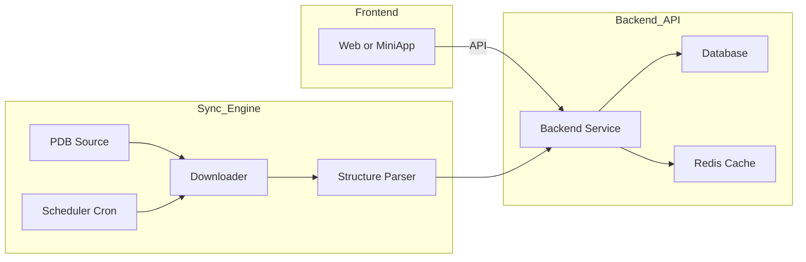

🚀 Protein Structure Management System
蛋白质分子结构管理系统（基于 PDB 自动同步）


本项目是一套面向生物技术企业、科研机构与结构生物学团队的 蛋白质分子结构管理平台。
支持蛋白质三维结构展示、解析、比对、版本化管理，并内置 自动 PDB 数据同步引擎，可自动保持结构数据最新。

系统由 前端、后端 API 服务、PDB 自动同步引擎 三大模块构成。

📐 系统架构（Mermaid Diagram）



✨ 功能特性
前端 Frontend

Protein 3D 结构可视化（Mol* / NGL）

模型旋转、切片、着色、显示模式切换

多结构叠合比对

蛋白链、序列、Resolution、来源等详情展示

用户登录、角色管理

蛋白收藏夹、标签系统

支持中英文界面

后端 Backend API Service

PDB 与 mmCIF 文件解析

结构元数据抽取（链、序列、长度、注释等）

RESTful API（查询结构/下载/搜索/解析任务）

结构文件转换（PDB ↔ CIF）

Redis 缓存

日志系统（同步日志 + API 日志）

RBAC 权限体系

自动同步引擎 Auto Sync Engine

自动同步 PDB (RCSB) 最新结构

支持全量与增量同步

自动执行下载 → 校验 → 解析 → 入库

Cron 定时任务

数据损坏检测与重试

支持同步完成推送（邮件/企业微信/飞书）

🧱 技术栈

- **前端**: Vue / React / Uni-App / Ant Design  
- **后端**: SpringBoot / Node.js / TypeScript  
- **数据库**: PostgreSQL / MySQL  
- **缓存**: Redis  
- **结构解析**: BioPython / BioJava / CIF Parser  
- **同步引擎**: Python + Cron + HTTP Client  
- **可视化**: Mol* Viewer / NGL Viewer  

🔧 **工具与技术支持：**
- 使用 **Mol* Viewer** 和 **NGL Viewer** 来展示蛋白质3D结构。  
- 后端采用 **SpringBoot / Node.js** 支持高性能 API 服务。


📁 项目结构

## Project Structure

```
root/
├── frontend/        # Web or MiniApp frontend
│   └── src/
│
├── backend/         # Backend API service
│   ├── src/
│   └── modules/
│
├── sync-engine/     # PDB auto-sync engine
│   ├── downloader/
│   ├── parser/
│   └── scheduler/
│
└── docs/            # Documentation
```


中文说明：
上述为项目完整结构，包括前端 Web/小程序、后端 API 服务、PDB 自动同步引擎模块。

🔧 安装与部署
1. 克隆项目
git clone https://github.com/yourname/protein-structure-system.git
cd protein-structure-system

2. 启动前端
cd frontend
npm install
npm run dev

3. 启动后端
cd backend
npm install
npm run start

4. 启动 PDB 自动同步引擎
cd sync-engine
python sync.py

📷 系统截图（占位）

可上传系统截图后，我可为你排版美化 README 中的展示区域。

Web 主界面

3D 蛋白结构可视化示例

PDB 同步进度日志

后端 API Swagger 页面

📌 TODO

 Docker / Docker Compose 自动部署

 增加 TM-align / CEalign 结构比对模块

 增加 AlphaFold、UniProt 等多数据源

 增加更多可视化模式

 完整自动化 CI/CD 流程
